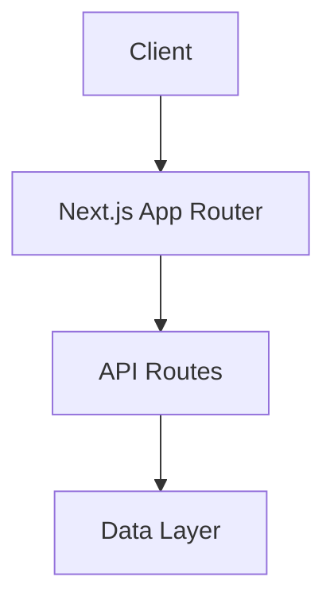

# System Architecture

## Core Components

### Frontend (Next.js App Router)
- **Role**: Main application interface
- **Dependencies**: React, Next.js
- **Status**: Active

#### Component Architecture
- **Client Components**:
  - Location: `/components/client`
  - Purpose: Interactive UI elements
  - Examples: Navigation, ErrorBoundary, ImageUploader
  - Features:
    - Marked with 'use client'
    - Handle user interactions
    - Manage local state
    - Dynamic imports

- **Server Components**:
  - Location: `/app/**/page.tsx`
  - Purpose: Static rendering and data fetching
  - Examples: Page components, layouts
  - Features:
    - Default in App Router
    - Static rendering
    - No client-side state
    - Direct database access

- **Dynamic Imports**:
  - Location: Client components only
  - Purpose: Code splitting and lazy loading
  - Implementation:
    ```typescript
    const DynamicComponent = dynamic(
      () => import('@/components/client/Component'),
      { ssr: false }
    );
    ```

- **Error Handling**:
  - ErrorBoundary for client components
  - Suspense for loading states
  - Consistent error responses
  - Detailed error logging

### Project Management System
- **Role**: Handles project data and operations
- **Dependencies**: MongoDB, TypeScript
- **Status**: Active
- **Components**:
  - Project Model with validation
  - Project Service layer
  - Settings management
  - Metadata tracking
  - Contributor system

### TypeScript Integration
- **Role**: Type safety and enhanced development experience
- **Dependencies**: TypeScript compiler
- **Status**: Active

## System Overview



## Technical Stack

### Frontend
- Next.js 13.5.11 (App Router)
- React
- TypeScript

### Development Tools
- Node.js
- npm
- Git

### Deployment Infrastructure
- **Platform**: Vercel
- **Environment**: Production
- **Authentication**: Required for API endpoints
- **Configuration**:
  - MongoDB connection via connection string (includes database name)
  - API authentication for endpoint protection
- **Database**: MongoDB Atlas
  - Connection management:
    - Unified connection string configuration
    - Automatic database name extraction from URI
    - Connection pooling with caching strategy
    - Comprehensive error logging
  - Development Features:
    - Hot Module Replacement (HMR) support
    - Shared database configuration
    - Enhanced debugging capabilities
  - Production Features:
    - Optimized connection management
    - Detailed error tracking
    - Verified data persistence and retrieval

## Component Architecture

The application follows Next.js 13+ conventions with the App Router architecture:
- `/app`: Main application routes and layouts
  - `/api`: API routes using Next.js Route Handlers
    - Dynamic routes use URL pathname for parameter extraction
    - Consistent error handling and response formatting
    - TypeScript integration with Next.js types
- `/components`: Reusable React components
- `/lib`: Utility functions and shared logic
- `/public`: Static assets

### Data Models

#### Project Model
```typescript
interface Project {
  _id?: ObjectId;
  name: string;
  slug: string;
  organizationId: ObjectId;
  visibility: 'public' | 'private';
  status: 'active' | 'archived';
  settings: ProjectSettings;
  metadata: ProjectMetadata;
  createdAt: Date;
  updatedAt: Date;
}
```

### API Route Handler Implementation
- **Type Safety**: Uses NextRequest from next/server
- **Parameter Handling**: Extracts dynamic parameters from request.nextUrl.pathname
- **Error Handling**: Consistent error responses with timestamps

### API Endpoints

#### Organization-Project Associations
```typescript
// List and manage organization projects
GET    /api/organizations/[id]/projects?status&visibility&page&limit&sort&order
PATCH  /api/organizations/[id]/projects  // Bulk operations
GET    /api/organizations/[id]/projects/stats

// Project transfers
POST   /api/projects/[id]/transfer
```

#### Projects API
```typescript
// List and create projects
GET /api/projects?organizationId&visibility&status&page&limit&tags
POST /api/projects

// Individual project operations
GET /api/projects/[id]?organizationId
PUT /api/projects/[id]
DELETE /api/projects/[id]
```
- **Response Format**:
  ```typescript
  {
    success: boolean;
    data?: T;
    error?: string;
    timestamp: string; // ISO 8601
  }
  ```

### Navigation Component
- **Role**: Primary application navigation system
- **Dependencies**: Next.js App Router, React
- **Status**: Active
- **Implementation**: 
  - Top-level navigation without breadcrumbs
  - Context-aware headers
  - Self-explanatory screen routing
  - Direct navigation through clear, intuitive paths
