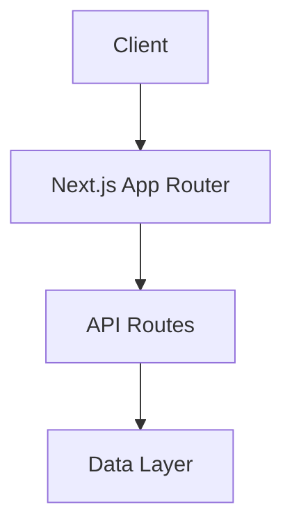

# System Architecture (v6.3.0)

## Core Components

### Authentication System
- **Role**: Manages user authentication and authorization
- **Dependencies**: NextAuth.js, MongoDB Adapter, JsonWebToken
- **Status**: Active

#### Core Features
- **Authentication Model**:
  - JWT-based authentication with enhanced token verification
  - Comprehensive role-based access control (RBAC)
  - Robust session management with MongoDB
  - Customizable authentication providers
  - Enhanced error handling and validation
  - User permission tracking and verification

#### Security Features
- **Data Protection**:
  - Secure session storage
  - HTTP-only cookies
  - JWT token encryption
  - Role-based resource access

#### Implementation Details
- **Data Layer**: MongoDB with public access
- **API Layer**: Public RESTful endpoints
- **Security Considerations**:
  - Rate limiting for API protection
  - DDoS protection recommended
  - Regular security audits essential
  - Content moderation may be needed

### Authentication Routes
- **Location**: `/app/auth`
- **Role**: Handles authentication flows
- **Dependencies**: NextAuth.js
- **Status**: Active
- **Components**:
  - Sign-in page
  - Error handling page
  - Session management
  - Authentication callbacks

### Frontend (Next.js App Router)
- **Role**: Main application interface
- **Dependencies**: React, Next.js 14.2.30
- **Status**: Active
- **Features**:
  - API Routes with proper TypeScript support
  - Enhanced error handling and validation
  - Standardized response types across endpoints

#### Component Architecture
- **Client Components**:
  - Location: `/components/client`
  - Purpose: Interactive UI elements
  - Examples: Navigation, ErrorBoundary
  - Features:
    - Marked with 'use client'
    - Handle user interactions
    - Manage local state
    - Dynamic imports

- **Server Components**:
  - Location: `/app/**/page.tsx`
  - Purpose: Static rendering and data fetching
  - Examples: Page components, layouts
  - Features:
    - Default in App Router
    - Static rendering
    - No client-side state
    - Direct database access

- **Dynamic Imports**:
  - Location: Client components only
  - Purpose: Code splitting and lazy loading
  - Implementation:
    ```typescript
    const DynamicComponent = dynamic(
      () => import('@/components/client/Component'),
      { ssr: false }
    );
    ```

- **Error Handling**:
  - ErrorBoundary for client components
  - Suspense for loading states
  - Consistent error responses
  - Detailed error logging

### Project Management System
- **Role**: Handles project data and operations
- **Dependencies**: MongoDB 5.9.0, Mongoose 7.6.0
- **Status**: Active
- **Components**:
  - Project Model with validation
  - Project Service layer
  - Settings management
  - Metadata tracking
  - Contributor system

### TypeScript Integration
- **Role**: Type safety and enhanced development experience
- **Dependencies**: TypeScript compiler
- **Status**: Active

## System Overview



### Technical Stack

### Authentication
- NextAuth.js (Latest)
- MongoDB Adapter
- JWT Session Strategy
- Custom Authentication Providers

### Frontend
- Next.js 14.0.4 (App Router)
- React
- TypeScript

### Development Tools
- Node.js
- npm
- Git

### Deployment Infrastructure
- **Platform**: Vercel
- **Environment**: Production
- **Authentication**: Public access for all endpoints
- **Configuration**:
  - MongoDB connection via connection string (includes database name)
  - API authentication for endpoint protection
- **Database**: MongoDB Atlas
  - Connection management:
    - Unified connection string configuration
    - Automatic database name extraction from URI
    - Connection pooling with caching strategy
    - Comprehensive error logging
  - Development Features:
    - Hot Module Replacement (HMR) support
    - Shared database configuration
    - Enhanced debugging capabilities
  - Production Features:
    - Optimized connection management
    - Detailed error tracking
    - Verified data persistence and retrieval

## Component Architecture

The application follows Next.js 13+ conventions with the App Router architecture:
- `/app`: Main application routes and layouts
  - `/api`: API routes using Next.js Route Handlers
    - Dynamic routes use URL pathname for parameter extraction
    - Consistent error handling and response formatting
    - TypeScript integration with Next.js types
- `/components`: Reusable React components
- `/lib`: Utility functions and shared logic
- `/public`: Static assets

### Data Models

#### Project Model
```typescript
interface Project {
  _id?: ObjectId;
  name: string;
  slug: string;
  organizationId: ObjectId;
  visibility: 'public' | 'private';
  status: 'active' | 'archived';
  settings: ProjectSettings;
  metadata: ProjectMetadata;
  createdAt: Date;
  updatedAt: Date;
}
```

### API Route Handler Implementation
- **Type Safety**: Uses NextRequest from next/server
- **Parameter Handling**: Extracts dynamic parameters from request.nextUrl.pathname
- **Error Handling**: Enhanced error handling with specific error types and timestamps
- **Authentication**: Unified authentication middleware with role and permission checks
- **Security**: Rate limiting and comprehensive request validation

### API Endpoints

#### Organization-Project Associations
```typescript
// List and manage organization projects
GET    /api/organizations/[id]/projects?status&visibility&page&limit&sort&order
PATCH  /api/organizations/[id]/projects  // Bulk operations
GET    /api/organizations/[id]/projects/stats

// Project transfers
POST   /api/projects/[id]/transfer
```

#### API Response Module
- **Location**: `/lib/api/response.ts`
- **Role**: Standardizes API response formatting across all endpoints
- **Dependencies**: None
- **Status**: Active

##### Implementation Details
```typescript
type ApiResponse<T> = {
  success: boolean;
  data?: T;
  error?: string;
  timestamp: string; // ISO 8601 with milliseconds
}

function formatApiResponse<T>(
  data: T | null,
  error?: string,
  statusCode: number = 200,
  rateLimitInfo?: RateLimitInfo
): ApiResponse<T>
```

##### Features
- Consistent response structure across all endpoints
- ISO 8601 timestamp with millisecond precision
- Type-safe response formatting
- Support for rate limiting information
- Proper error handling and status codes

#### Projects API
```typescript
// List and create projects
GET /api/projects?organizationId&visibility&status&page&limit&tags
POST /api/projects

// Individual project operations
GET /api/projects/[id]?organizationId
PUT /api/projects/[id]
DELETE /api/projects/[id]
```
- **Response Format**:
  ```typescript
  {
    success: boolean;
    data?: T;
    error?: string;
    timestamp: string; // ISO 8601
  }
  ```

## Module Boundaries and Interactions

### Organizations Module
- **Location**: `/app/organizations`
- **Role**: Manages organization data and operations
- **Components**:
  - Independent layout with organization-specific navigation
  - Organization list and detail views
  - Organization settings management
  - Member management interface
  - NewOrganizationModal for entity creation
- **API Endpoints**:
  - GET /api/organizations - List organizations
  - POST /api/organizations - Create organization
  - GET /api/organizations/current - Get current active organization
  - DELETE /api/organizations/[id] - Delete organization and associated projects
- **Data Requirements**:
  - Name (required): Organization display name
  - Slug (auto-generated): URL-friendly identifier
  - Description (optional): Detailed information
- **Service Features**:
  - Transaction-safe deletion of organizations and projects
- Enhanced error handling with specific error types
- Session interface extension with extendable fields
- Full TypeScript type support
  - ID validation before operations
  - Detailed operation status reporting
  - Type-safe deletion tracking with MongoDB DeleteResult interface
  - Proper variable scoping for transaction operations
- **Return Types**:
  - Delete Operation: { success: boolean; deletedProjectsCount: number }
  - Standard Error Types: 'NotFoundError', 'ValidationError', 'DatabaseError'
- **Interactions**:
  - Projects Module: Organization-project associations and cascading deletions
  - Database Layer: Transactional operations for data integrity
  - Logging System: Detailed operation tracking

### Projects Module
- **Location**: `/app/projects`
- **Role**: Handles project operations and metadata
- **Components**:
  - Project-specific layout and navigation
  - Project creation and management views
  - Project settings interface
  - Resource allocation tools
  - NewProjectModal for entity creation
- **API Endpoints**:
  - GET /api/projects - List projects
  - POST /api/projects - Create project
- **Data Requirements**:
  - Name (required): Project display name
  - Slug (auto-generated): URL-friendly identifier
  - Description (optional): Detailed information
  - OrganizationId (required): Owner organization reference
  - Visibility (required): public/private setting
  - Status (required): active/archived state
  - Settings (auto-initialized):
    - allowComments: boolean
    - moderateComments: boolean
    - enableSharing: boolean
    - allowDownloads: boolean
    - allowedFileTypes: string[]
  - Metadata (auto-initialized):
    - lastActivity: Date
    - tags: string[]
    - contributors: string[]
- **Interactions**:
  - Organizations Module: Project ownership and transfers
  - Builder Module: Project content editing
  - Current Organization Context: Required for project creation

### Shared UI Components
- **Location**: `/components/shared`
- **Role**: Reusable UI elements across modules
- **Status**: Active
- **Components**:
  - **Button System**:
    - Consistent indigo color scheme (600/500)
    - Standardized focus states
    - Loading state integration
  - **Form Elements**:
    - Unified input styling
    - Consistent validation states
    - Standardized error messages
  - **Loading States**:
    - Unified loading indicators
    - Consistent spinner animations
    - Skeleton loading patterns
  - **Error Messages**:
    - Standard error display format
    - Consistent styling and positioning
    - Clear error feedback
  - **Responsive Layouts**:
    - Consistent breakpoint handling
    - Unified grid systems
    - Standard spacing patterns


### Navigation Component
- **Role**: Primary application navigation system
- **Dependencies**: Next.js App Router, React
- **Status**: Active
- **Implementation**: 
  - Top-level navigation without breadcrumbs
  - Context-aware headers
  - Self-explanatory screen routing
  - Direct navigation through clear, intuitive paths
