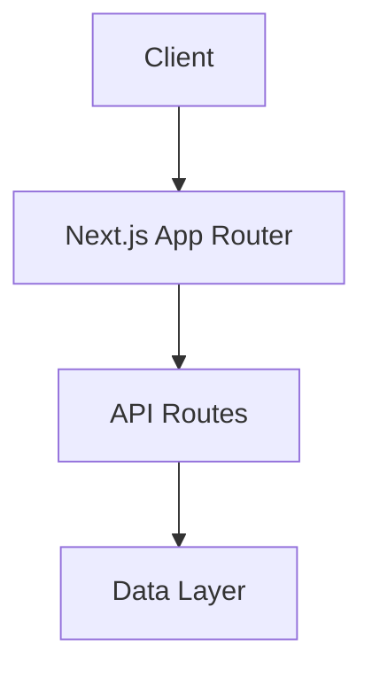

# System Architecture

## Core Components

### Frontend (Next.js App Router)
- **Role**: Main application interface
- **Dependencies**: React, Next.js
- **Status**: Active

### TypeScript Integration
- **Role**: Type safety and enhanced development experience
- **Dependencies**: TypeScript compiler
- **Status**: Active

## System Overview

## Technical Stack

### Frontend
- Next.js (App Router)
- React
- TypeScript

### Development Tools
- Node.js
- npm
- Git

## Component Architecture

The application follows Next.js 13+ conventions with the App Router architecture:
- `/app`: Main application routes and layouts
- `/components`: Reusable React components
- `/lib`: Utility functions and shared logic
- `/public`: Static assets

### Navigation Component
- **Role**: Primary application navigation system
- **Dependencies**: Next.js App Router, React
- **Status**: Active
- **Implementation**: 
  - Top-level navigation without breadcrumbs
  - Context-aware headers
  - Self-explanatory screen routing
  - Direct navigation through clear, intuitive paths
